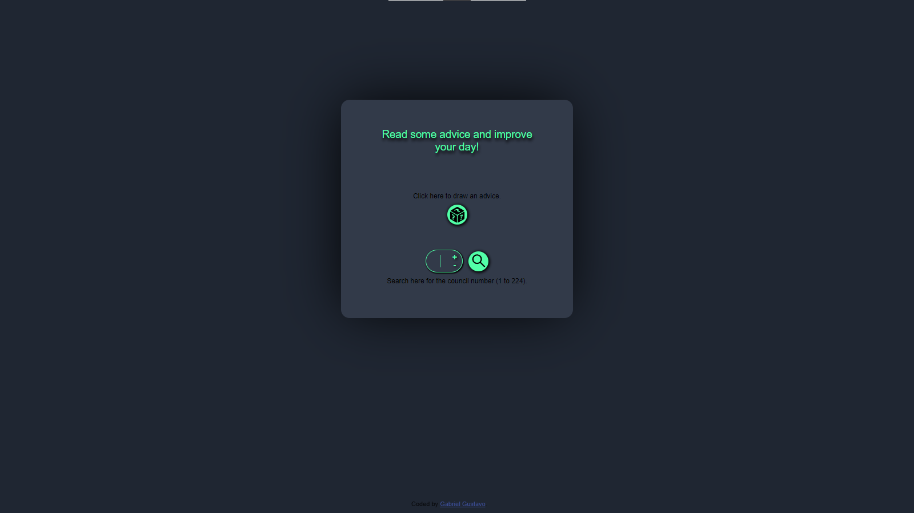
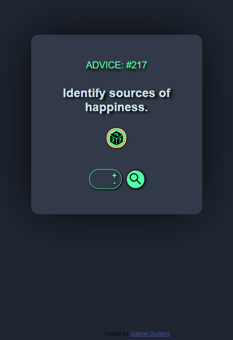

&#xa0;
<div style="display: inline_block" align="center"><br>
  
  
  
  
</div>

<h1 align="center">&#x2728 Advices &#x2728</h1>

## <a target="_blank" href="https://tangerine-lily-1fe723.netlify.app/"  ><p align="center">Clique aqui para visitar o site<p></a>
</div>


# :mag: Preview


<details close align="center">
  <summary> 
     Preview do site no modo desktop 💻
  </summary>
   <h1 style="margin: auto">
   
   </h1>
</details>

<details close align="center">
  <summary> 
     Preview do site no modo mobile 📱
  </summary>
   <h1 style="margin: auto">
   
   </h1>
</details>

<br>
<p align="center">
  <a href="#dart-about">About</a> &#xa0; | &#xa0; 
  <a href="#sparkles-features">Features</a> &#xa0; | &#xa0;
  <a href="#rocket-technologies">Technologies</a> &#xa0; | &#xa0;
  <a href="#white_check_mark-requirements">Requirements</a> &#xa0; | &#xa0;
  <a href="#checkered_flag-starting">Starting</a> &#xa0; | &#xa0;
  <a href="https://github.com/Gustabriel" target="_blank">Author</a>
</p>

<br>

# :dart: About #

####  Projeto desenvolvido com o objetivo de ser uma página que contém uma api com 224 conselhos, que podem ser pesquisados pelo seu id ou pode ser sorteado e é exibida para o usuário na tela.

# :sparkles: Features #

:heavy_check_mark: Botão de sorteio;\
:heavy_check_mark: Opção de pesquisa;\
:heavy_check_mark: Input Number personalizado;\
:heavy_check_mark: Aplicação responsiva;


# :rocket: Technologies #

The following tools were used in this project:

- [ReactJS](https://pt-br.reactjs.org/)
- [React-icons](https://react-icons.github.io/react-icons/)
- [CSS](https://www.w3schools.com/css/default.asp)

# :computer: Learning #

:heavy_check_mark: Praticando o useState;\
:heavy_check_mark: Blibiotecas do ReactJS;\
:heavy_check_mark: Praticando CSS;\
:heavy_check_mark: Fetch, Async, Await;

# :white_check_mark: Requirements #

Before starting :checkered_flag:, you need to have [Git](https://git-scm.com) and [Node](https://nodejs.org/en/) installed.

# :checkered_flag: Starting #

```bash
# Clone this project
$ git clone https://github.com/Gustabriel/advices

# Access
$ cd advices

# Install dependencies
$ yarn

# Run the project
$ yarn start

# The server will initialize in the <http://localhost:3000>
```

# :memo: Dev #

<p align="center"> Made with :heart: by <a href="https://github.com/Gustabriel" target="_blank">Gabriel Gustavo</a></p>

<p align="center"></p>


&#xa0;

<p  align="center" ><a href="#top">Back to top</a></p>
